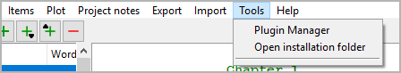
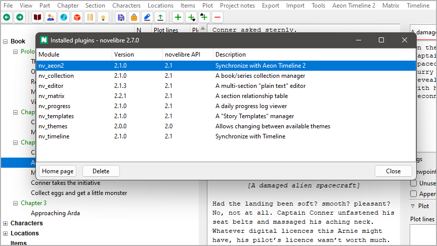

Tools menu
==========

**Miscellaneous functions**

.. note:: 
   The *Tools* menu can be extended by plugins to add more
   features.

Plugin manager
--------------

**Display and manage installed plugins**

With **Tools > Plugin manager**,
you can open the *Installed plugins* dialog.

-  Successfully installed plugins are displayed black on white by
   default.
-  Outdated plugins are grayed out.
-  Plugins that cannot run are displayed in red, with an error message.

How to update a plugin
   1. Select the plugin you want to update. If the **Home page** button is
      activated, you can click on it, and your system browser opens the plugin
      home page. Otherwise, you have to know the source of the plugin yourself.
   2. Go to the plugin home page and download the latest release. Install it
      according to the instructions.

How to uninstall a plugin
   Select the plugin, and click on the **Delete** button.

.. admonition:: About version compatibility
    
   On the window frame, you see the *mdnovel* version, consisting of
   three numbers that are separated by points.
   
   ``<major version number>.<minor version number>.<patch level>``
   
   In the **mdnovel API** column, you see the plugin’s compatibility
   information, consisting of two numbers that are separated by points.
   
   ``<major version number>.<minor version number>``
   
   The rule for compatibility
      -  The plugin’s *mdnovel API* major version number must be the same as
         *mdnovel’s* major version number.
      -  The plugin’s *mdnovel API* minor version number must be less than
         or equal to *mdnovel’s* minor version number.
   
   Fix incompatibilities
      -  If the plugin’s *mdnovel API* major version number is greater than
         *mdnovel’s* major version number, *mdnovel* needs to be updated.
      -  If the plugin’s *mdnovel API* major version number is less than
         *mdnovel’s* major version number, the plugin needs to be updated.
      -  If the plugin’s *mdnovel API* minor version number is greater than
         *mdnovel’s* minor version number, *mdnovel* needs to be updated.

Open installation folder
------------------------

**Launch the file manager**

With **Tools > Open installation folder**,
you can launch the file manager with the *mdnovel* installation folder.
This might come in handy if you wish to edit configuration files,
or install your own plugins.

